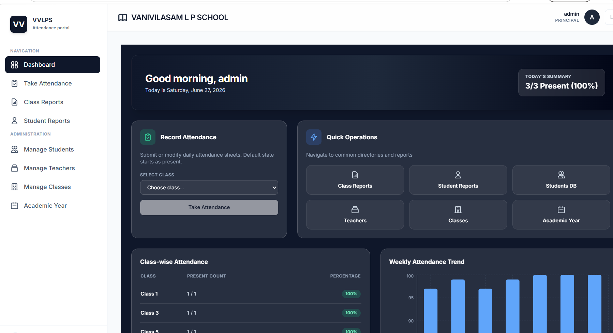
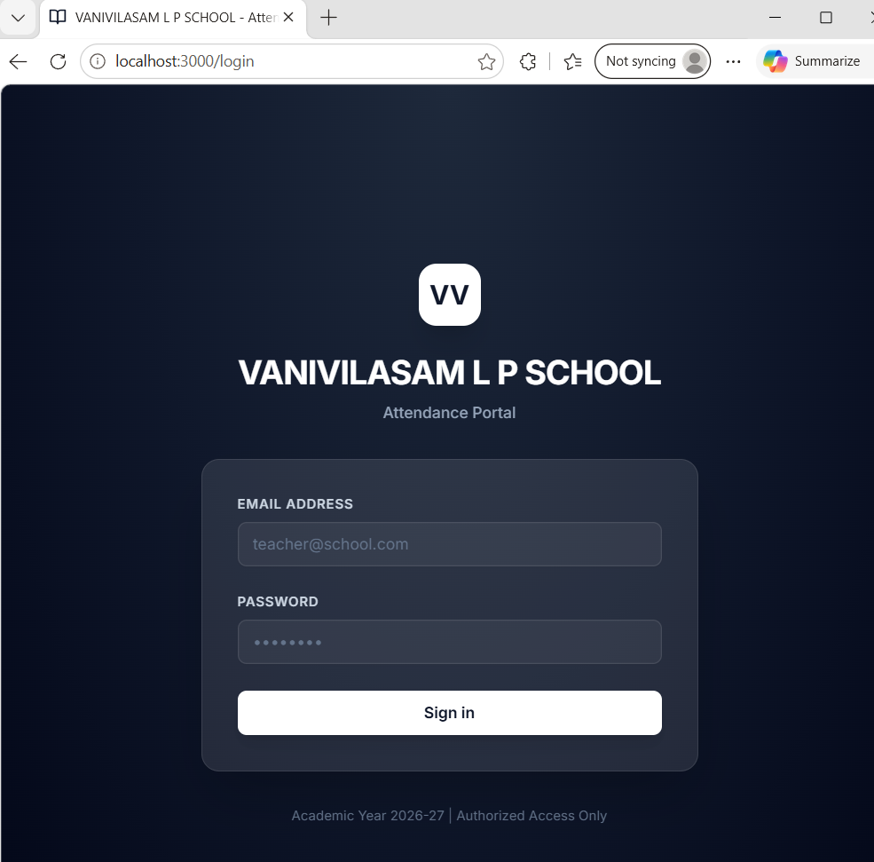

#School Attendance Management System

A full-stack attendance management system built for **VANIVILASAM L P SCHOOL** (LKG-5th, ~250 students). Teachers can mark daily attendance in under 2 minutes, and the system automatically calculates year-end attendance summaries for report cards and Transfer Certificates (TC).
-----------------------------------------------------------------------------------------------------------------------------------------------

##🎯The Problem Solved


**Before:** Teachers spent **days manually counting attendance** at year-end for report cards and TC.  
**After:** The system auto-calculates attendance summaries in **2 seconds**.
-------------------------------------------------------------------------------------------------------------------------------------------------

##Features


| Feature | Description |
|---------|-------------|
| **✅ Teacher Dashboard** | Mark attendance (default: all present, tap to mark absent) |
| **✅ Year-End Reports** | Auto-calculate present/absent days for any date range |
| **✅ Admin Panel** | Manage students, teachers, classes, and academic years |
| **✅ Role-Based Access** | Teachers see only their assigned classes |
| **✅ PDF Export** | Generate professional report cards and TC summaries |
| **✅ Holiday Management** | Add holidays, working Saturdays, and academic years |
| **✅ Weekend Handling** | Automatically excludes Saturdays and Sundays |
------------------------------------------------------------------------------------------------------------------------------------------------


###Tech Stack


| Layer | Technology |
|-------|------------|
| **Backend** | FastAPI (Python) |
| **Database** | SQLite (local) / PostgreSQL (production) |
| **Frontend** | React + Vite + Tailwind CSS |
| **Authentication** | JWT (Bearer tokens) |
| **PDF Generation** | reportlab |
| **ORM** | SQLAlchemy (async) |
-------------------------------------------------------------------------------------------------------------------------------------------------


###Screenshots


**Dashboard**   
**Login Page**   |
**Take Attendance**   
**Manage Students**  |
**Manage Teachers**   
**Manage Classes**   |
**Class Reports**   
**Holiday Management**   
-------------------------------------------------------------------------------------------------------------------------------------------------


###🚀Quick Start


###Prerequisites

- Python 3.10+
- Node.js 18+
- Git


###Backend Setup

```bash
cd backend_code
python -m venv venv
venv\Scripts\activate
pip install -r requirements.txt
uvicorn main:app --reload --host 0.0.0.0 --port 8000

### Frontend Setup

cd frontend_code
npm install
npm run dev

###Default Admin Credentials

Email: admin@school.com
Password: admin123
----------------------------------------------------------------------------------------------------------------------------------------------

###📁 Project Structure

attendance_system/
├── backend_code/
│   ├── routes/          # API endpoints
│   ├── models.py        # SQLAlchemy models
│   ├── auth.py          # JWT authentication
│   ├── database.py      # Database connection
│   └── main.py          # FastAPI app
├── frontend_code/
│   ├── src/
│   │   ├── pages/       # All UI pages
│   │   ├── components/  # Reusable components
│   │   └── lib/         # API client
│   └── package.json
├── database_schema.sql
├── requirements.txt
└── README.md
------------------------------------------------------------------------------------------------------------------------------------------------

### Features Tested

✅ Teacher login (role-based access)
✅ Admin login (full access)
✅ Daily attendance marking
✅ Year-end report generation
✅ PDF export
✅ Holiday management
✅ Soft delete (data preservation)
✅ Weekend auto-exclusion


### Deployment

Backend (Render)
1.Push code to GitHub
2.Connect repo to Render
3.Set build command: pip install -r requirements.txt
4.Set start command: uvicorn main:app --host 0.0.0.0 --port 10000

Frontend (Vercel)
1.Push code to GitHub
2.Connect repo to Vercel
3.Deploy automatically


###Future Improvements

1.Bulk import students via CSV/Excel
2.Parent portal (view-only)
3.SMS notifications for absent students
4.Mobile app for teachers
-------------------------------------------------------------------------------------------------------------------------------------------------

### 👤 Author

Avani A – 3rd Year CSE, SRM University
Big Data Analytics Specialization